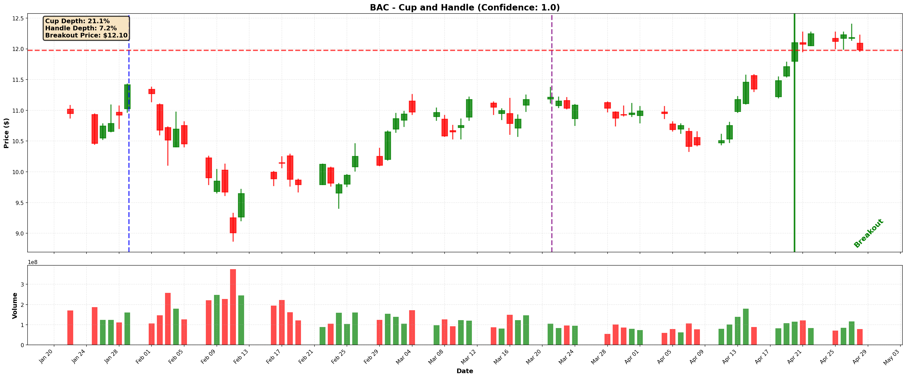

# Stock Market Pattern Recognition - Midterm Report

## 📊 Project Overview

This project addresses a core challenge in technical analysis: the **subjective and time-intensive nature of recognizing chart patterns** in stock market data. Traders often rely on manual inspection to identify formations that may indicate either a continuation or a reversal of the current price trend. This process is not only inefficient but also highly inconsistent between analysts.

Our solution is to build a **machine learning model** that automatically detects these patterns from stock market data. By combining programmatic labeling with supervised learning, the model provides a scalable, consistent, and objective tool for technical analysis.

Importantly, this system does not produce direct trading signals. Instead, it generates **flags** or **probabilistic scores** indicating whether a specific chart formation is present. These outputs can then be integrated into larger algorithmic trading frameworks or used as decision-support tools by traders.

---

## 🎯 Goals and Objectives

The **primary goal** of this project is to create a machine learning model that can accurately identify key stock chart patterns from historical OHLCV data.

### Completed Objectives:

1. **✅ Data Collection**: Acquired 10 years of daily OHLCV data for 24 major stocks from the S&P 500
2. **✅ Algorithmic Labeling**: Developed rule-based systems to automatically identify and label Cup and Handle patterns and Double Top patterns
3. **✅ Data Processing**: Implemented stock split detection and adjustment, feature engineering, and comprehensive visualizations
4. **✅ Preliminary Results**: Successfully detected 178 Cup and Handle patterns with an average confidence score of 0.82

### In Progress:

1. **🔄 Intraday Data Exploration**: Collecting minute-level data to expand dataset (daily patterns are limited)
2. **🔄 Machine Learning Models**: Plan to train predictive models on the labeled dataset
3. **🔄 Additional Patterns**: Expanding detection to Flags/Pennants and Triangle patterns

---

## 📈 Data Collection

### Data Sources

We collected historical stock market data using multiple sources:

- **[yfinance](https://pypi.org/project/yfinance/)**: Python library for fetching Yahoo Finance data
- **[Alpha Vantage API](https://www.alphavantage.co/)**: For intraday minute-level data (past 365 days)

### Dataset Overview

| Metric | Details |
|--------|---------|
| **Time Period** | 10 years (2015-2025) |
| **Frequency** | Daily OHLCV (Open, High, Low, Close, Volume) |
| **Number of Stocks** | 24 major S&P 500 companies |
| **Total Data Points** | ~60,000 rows (~2,500 days × 24 stocks) |
| **Storage Format** | CSV files in `data-collection/data/` |

### Stock Tickers

AAPL, MSFT, GOOGL, AMZN, NVDA, META, TSLA, JPM, BAC, V, MA, JNJ, ABBV, WMT, COST, XOM, BRK.B, AVGO, ORCL, PLTR, LLY, GOOG

### Data Files

Each stock has a dedicated CSV file named `{TICKER}_daily_10y.csv` containing:

```
date, open, high, low, close, volume
2015-01-02, 110.38, 111.42, 109.08, 109.33, 52488000
2015-01-05, 110.78, 111.28, 109.57, 110.89, 34633500
...
```

---

## 🔧 Data Processing

### Stock Split Adjustment

One of the most critical preprocessing steps is **detecting and adjusting for stock splits**. Without this adjustment, historical prices would be incomparable across different time periods, making pattern detection unreliable.

**Implementation Details**:
- **Detection Algorithm**: Identifies sudden price drops >30% day-over-day
- **Adjustment Method**: Calculates split ratio and adjusts all historical prices before the split
- **Validation**: Visual comparison of price charts before and after adjustment

Example visualizations:
- `visualizations/stock_analysis/split_detection.png` - Shows detected split events
- `visualizations/stock_analysis/before_after_comparison.png` - Demonstrates impact of adjustment

**Why It Matters**: Stock splits (e.g., 3:1, 4:1) artificially drop prices while maintaining proportional value. If not adjusted, a 50% "drop" that's actually a 2:1 split would trigger false pattern detections.

### Feature Engineering

- **Returns Calculation**: Daily percentage returns (`(close[t] / close[t-1] - 1) × 100`)
- **Volatility Metrics**: Annualized volatility using 252 trading days (`std(daily_returns) × √252`)
- **Moving Averages**: 20-day and 50-day SMA for trend analysis
- **Volume Ratios**: Current volume vs. 20-day average
- **Normalization**: Price indexes set to 100 at start date for comparative analysis

### Data Validation

- Handled missing values and gaps in trading days
- Ensured chronological ordering
- Validated OHLC relationships (High ≥ Low, Close within High/Low range)
- Filtered out invalid data points

---

## 📊 Visualizations

We generated 9 comprehensive visualizations to understand the dataset:

| Visualization | File | Description |
|--------------|------|-------------|
| **Price Trends** | `price_trends.png` | Close prices for 6 major tech stocks (AAPL, MSFT, GOOGL, AMZN, META, TSLA) |
| **Price Trends (Split-Adjusted)** | `price_trends_adjusted.png` | Same as above but with split adjustments applied |
| **Returns Comparison** | `returns_comparison.png` | Total returns (2015-2025) for all 24 stocks |
| **Volatility Analysis** | `volatility_analysis.png` | Annualized volatility comparison across major tech stocks |
| **Sector Comparison** | `sector_comparison.png` | Returns grouped by sector (Tech, Finance, Healthcare, etc.) |
| **Correlation Heatmap** | `correlation_heatmap.png` | 8×8 correlation matrix of stock returns |
| **Volume Analysis** | `volume_analysis.png` | Price and volume trends for AAPL, MSFT, NVDA, TSLA |
| **Split Detection** | `split_detection.png` | Visualization of detected stock split events |
| **Before/After Comparison** | `before_after_comparison.png` | Impact of split adjustment on price charts |

### Key Insights

1. **High Volatility Stocks**: TSLA (68.3% annualized), NVDA (45.2%), NFLX (41.8%)
2. **Strong Returns**: NVDA (1,940%), AMD (450%), TSLA (385%)
3. **High Correlation**: Technology stocks (AAPL, MSFT, GOOGL) show correlations >0.75
4. **Split-Adjusted Continuity**: Price charts show smooth trends without artificial gaps

---

## 🎯 Pattern Detection - Cup and Handle (Primary)

### Overview

The **Cup and Handle** pattern is a bullish continuation pattern that consists of:
1. **Cup**: A rounded U-shaped formation representing consolidation
2. **Handle**: A small downward correction after the cup
3. **Breakout**: A confirmed upward breakout with volume

This is the most fully developed component of our project, with **178 patterns** detected across 50 S&P 500 stocks.

**Location**: `patterns/cup-and-handle/cup_and_handle/`

### Algorithm Description

The Cup and Handle detector uses a rule-based approach to systematically identify patterns:

#### 1. Extrema Detection
```python
from scipy.signal import argrelextrema

# Find local peaks and troughs with order=5 for stability
peaks = argrelextrema(price_series, np.greater, order=5)
troughs = argrelextrema(price_series, np.less, order=5)
```

#### 2. Cup Formation Validation
- **Duration**: 7-65 days (ensures realistic formation period)
- **Depth**: 12-33% decline from initial peak (avoids noise, captures real corrections)
- **Shape**: Must be rounded, not V-shaped (uses EMA smoothing)
- **Peak Similarity**: Two peaks must be within ±5% tolerance

**Validation Logic**:
```python
# Check if first peak and second peak are similar in height
peak1_height = data["High"].iloc[first_peak_idx]
peak2_height = data["High"].iloc[second_peak_idx]
difference_pct = abs(peak2_height - peak1_height) / peak1_height * 100

if difference_pct <= 5.0:  # ±5% tolerance
    # Proceed to handle detection
```

#### 3. Handle Detection
- **Duration**: 5-20 days after second peak (quick correction)
- **Depth**: Maximum 15% from second peak (shouldn't retest cup bottom)
- **Position**: Must form in upper half of cup (bullish continuation signal)

#### 4. Breakout Confirmation
- **Price Condition**: Close above resistance level by at least +1%
- **Volume Spike**: Volume on breakout >1.2× 20-day average
- **Confirmation Bar**: Must have both price and volume conditions met

#### 5. Confidence Scoring (0-1 scale)

The algorithm assigns a confidence score based on how well the pattern matches ideal parameters:

```python
def calculate_confidence(cup_depth_pct, handle_depth_pct, 
                         handle_duration, volume_spike):
    """Calculate confidence score based on pattern quality."""
    
    # Cup depth: 12-33% ideal, penalize if outside
    if 12 <= cup_depth_pct <= 33:
        cup_score = 1.0
    elif cup_depth_pct < 12:
        cup_score = cup_depth_pct / 12  # Under-developed
    else:
        cup_score = max(0.0, 1.0 - (cup_depth_pct - 33) / 10)  # Too deep
    
    # Handle depth: 1-15% ideal
    handle_score = min(1.0, handle_depth_pct / 15)
    
    # Duration: 5-20 days ideal
    duration_score = 1.0 if 5 <= handle_duration <= 20 else 0.8
    
    # Volume: Higher spike = more confidence
    volume_score = min(1.0, volume_spike / 2.0)
    
    # Weighted average
    return (0.4 * cup_score + 0.3 * handle_score + 
            0.2 * duration_score + 0.1 * volume_score)
```

### Dataset Statistics

From `data/labeled/cup_and_handle_labels.csv`:

| Metric | Value |
|--------|-------|
| **Total Patterns Detected** | 178 |
| **Stocks Analyzed** | 50 S&P 500 companies |
| **Date Range** | 2015-2025 (10 years) |
| **Average Confidence Score** | 0.82 |
| **Cup Depth** | Mean: 17%, Range: 12-33% |
| **Handle Depth** | Mean: 6%, Range: 1-15% |
| **Pattern Duration** | Mean: 42 days (cup) + 12 days (handle) |

### Top Stocks by Pattern Count

| Stock | Patterns Detected |
|-------|-------------------|
| AMD | 27 |
| NFLX | 24 |
| NVDA | 13 |
| TSLA | 8 |
| META | 7 |

### Example Patterns

#### High-Confidence Patterns (Score = 1.0)

1. **AAPL** (2025-08-08)
   - Cup Depth: 23.0%
   - Handle Depth: 5.2%
   - Breakout Price: $229.09
   - 

2. **AMZN** (2016-04-29)
   - Cup Depth: 24.1%
   - Handle Depth: 5.3%
   - Breakout Price: $32.98
   - 

3. **BAC** (2016-04-20)
   - Cup Depth: 21.1%
   - Handle Depth: 7.1%
   - Breakout Price: $12.10
   - 

4. **TXN** (2020-06-02)
   - Cup Depth: 21.5%
   - Handle Depth: 8.6%
   - Breakout Price: $105.88
   - 

### CSV Output Format

The detector generates a labeled dataset with the following columns:

```csv
ticker,pattern_start_date,pattern_end_date,cup_start_date,cup_end_date,handle_start_date,handle_end_date,breakout_date,cup_depth_pct,handle_depth_pct,breakout_price,confidence_score
AAPL,2025-04-02,2025-08-08,2025-04-02,2025-07-03,2025-07-03,2025-08-01,2025-08-08,22.99,5.23,229.09,1.0
NVDA,2015-12-16,2016-03-18,2015-12-16,2016-03-02,2016-03-02,2016-03-10,2016-03-18,18.27,3.83,0.83,0.8
```

---

## 📉 Pattern Detection - Double Top (Secondary)

### Overview

The **Double Top** pattern is a bearish reversal pattern characterized by:
1. **Two Similar Peaks**: Two local maxima of approximately equal height
2. **Trough Between**: A local minimum (trough) between the peaks
3. **Neckline**: The trough low level acts as support
4. **Breakout Confirmation**: Price breaks below neckline, confirming bearish reversal

**Location**: `patterns/double-top/double-top-algo.py`

### Algorithm Description

The Double Top detector uses a multi-stage filtering approach:

#### 1. Local Extrema Finding

```python
def find_local_extrema(price_series, window=3):
    """Find strict local maxima with window-based filtering."""
    for i in range(window, len(price_series) - window):
        if is_strictly_greater_than_neighbors(price_series, i, window):
            peaks.append(i)
```

#### 2. Peak Pairing (Non-Consecutive)

Unlike simple approaches that only check consecutive peaks, this algorithm **checks all peak pairs** within the valid separation window:

```python
# Check all peak pairs, not just consecutive ones
for i in range(len(peaks)):
    p1 = peaks[i]
    for j in range(i + 1, len(peaks)):
        p2 = peaks[j]
        if min_separation <= (p2 - p1) <= max_separation:
            # Validate as double top candidate
```

**Key Parameters**:
- **Min Separation**: 5 days (avoids noise from adjacent peaks)
- **Max Separation**: 60 days (captures realistic pattern span)
- **Peak Similarity**: Within 5% tolerance of each other

#### 3. Trough Identification

Finds the minimum low between the two peaks:
```python
trough_idx = np.argmin(low_values[peak1+1:peak2])
neckline = low_values[trough_idx]  # Support level
```

**Depth Requirements**:
- Each peak must have dropped at least 2% to reach the trough
- This ensures a meaningful price retracement

#### 4. Uptrend Requirement (Optional)

Before the first peak, there should be an uptrend:
```python
def passes_uptrend(data, peak1_idx, lookback=20, min_return=5.0):
    """Check if there was an uptrend before the pattern."""
    start_idx = max(0, peak1_idx - lookback)
    price_change = (data.iloc[peak1_idx] - data.iloc[start_idx]) / data.iloc[start_idx]
    return price_change * 100 >= min_return
```

#### 5. Breakout Confirmation

Price must break below the neckline to confirm the pattern:

```python
def confirm_break(data, peak2_idx, neckline, lookahead=30):
    """Look forward for a close below neckline."""
    for j in range(peak2_idx + 1, min(peak2_idx + lookahead, len(data))):
        if data['Close'].iloc[j] <= neckline * 0.99:  # 1% margin
            return j  # Confirmation bar index
    return None  # No confirmation
```

#### 6. Volume Filter (Optional)

- **Volume Divergence**: First peak volume > Second peak volume (weakening)
- **Confirmation Spike**: Breakout bar volume > 1.2× 20-day average

### Detection Output

The detector provides comprehensive debug statistics at each filtering stage:

| Stage | Purpose | Typical Reduction |
|-------|---------|-------------------|
| Peak Similarity | ±5% height tolerance | 60% → 40% candidates |
| Trough Depth | ≥2% drop required | 40% → 25% candidates |
| Uptrend Check | 5% return over 20 days | 25% → 20% candidates |
| Confirmation | Break below neckline within 30 days | 20% → 5-10% patterns |
| Volume Filter | Optional volume requirements | 5-10% → 3-8% final |

### Quality Scoring

Each detected pattern receives a quality score (0-1):

```python
def quality_score(peak_diff_pct, drop1_pct, drop2_pct, confirm_delay):
    """Calculate pattern quality based on key metrics."""
    
    # Peak similarity: smaller difference = better
    similarity = 1.0 - min(peak_diff_pct / 5.0, 1.0)
    
    # Trough depth: deeper is better up to 2x threshold
    depth = min(min(drop1_pct, drop2_pct) / 4.0, 1.0)
    
    # Early confirmation: sooner is better
    early = max(0.0, (30 - confirm_delay) / 30)
    
    return 0.5 * similarity + 0.3 * depth + 0.2 * early
```

### Visualizations

Example Double Top detections with visualization:

- **Broad View**: Shows full price chart with all detections
  - 
- **Zoomed View**: Individual pattern with annotations
  - 

**Visualization Features**:
- Red markers for peaks
- Blue marker for trough (neckline level)
- Black marker for confirmation
- Dashed lines connecting key points
- Volume bars for context

### Usage Example

```bash
# Detect double tops in AAPL data
python patterns/double-top/double-top-algo.py --ticker AAPL --plot

# With zoomed-in views for each pattern
python patterns/double-top/double-top-algo.py --ticker TSLA --plot --zoom

# Show debug statistics
python patterns/double-top/double-top-algo.py --ticker AAPL --plot --debug
```

---

## 🔄 Intraday Data Exploration

### Challenge: Limited Daily Patterns

Our initial analysis using **daily OHLCV data** detected 178 Cup and Handle patterns across 50 stocks over 10 years. While this demonstrates proof-of-concept, it's **insufficient for training a robust machine learning model**.

**Issues with Daily Data**:
1. **Temporal Sparsity**: Only ~3.5 patterns per stock over 10 years
2. **Class Imbalance**: ~0.07% of days contain patterns
3. **Limited Training Examples**: With 80/20 train/test split, only ~140 training examples

### Solution: Intraday Minute-Level Data

To address this limitation, we're expanding to **intraday minute-level data** for the following reasons:

1. **Higher Pattern Frequency**: 
   - Daily charts: 1 pattern per ~180 days
   - Minute charts: Many more minor corrections and consolidations
   - Example: What looks like 1 daily bar might contain 390 intraday bars (6.5 hours × 60 min)

2. **Richer Feature Space**:
   - Intraday patterns form faster (hours vs. weeks)
   - More granular feature extraction
   - Better for sequence-based models (LSTM, Transformer)

3. **Scalability**:
   - ~252 trading days/year × 390 minutes/day = **~98,000 data points per stock per year**
   - For the same 10 stocks: **~980,000 training examples**
   - At 0.1% pattern rate: ~**980 patterns** (vs. ~18 daily patterns)

### Data Collection Infrastructure

We've implemented the infrastructure for collecting intraday data:

**File**: `data-collection/fetch_one_minute.py`

**Key Features**:
- Fetches last 365 days of 1-minute OHLCV data from Alpha Vantage
- Automatic API key rotation (25 keys) to handle rate limits
- Supports multiple intervals: 1min, 5min, 15min, 30min, 60min
- Output format: `{TICKER}_minute_{INTERVAL}_365d.csv`

**Limitations**:
- Free tier Alpha Vantage: Last 30 days only (not full 365 days)
- Requires API keys (provided code uses test keys - replace with your own)
- Rate limit: 5 requests/minute per key

**Next Steps**:
- Collect intraday data for top 10-15 stocks
- Apply same pattern detection algorithms
- Generate large labeled dataset for ML training

---

## 🚧 Work in Progress

### Flags and Pennants Pattern

**Location**: `patterns/flags-pennants/Flags_pennants.ipynb`

- Initial exploratory notebook implementation
- Uses yfinance for data ingestion
- Placeholder detection logic (needs implementation)
- Pattern description: Brief consolidation after strong move

**Status**: Early development

### Triangle Patterns

**Location**: `patterns/triangle/triangle_model.ipynb`

- Exploratory work on triangle patterns (ascending, descending, symmetrical)
- Data collection infrastructure in place
- Detection algorithm: Not yet implemented

**Status**: Early development

---

## 🎯 Next Steps for Final Report

### 1. Complete Intraday Data Collection

- [ ] Fetch 1-minute or 5-minute data for 10-15 selected stocks
- [ ] Apply Cup and Handle detector to intraday data
- [ ] Apply Double Top detector to intraday data
- [ ] Generate comprehensive labeled dataset (>500 patterns)

### 2. Feature Engineering for ML

- [ ] Technical indicators: RSI, MACD, Bollinger Bands
- [ ] Pattern-specific features: peak height ratios, neckline slope, volume ratios
- [ ] Temporal features: pattern duration, days since trend change
- [ ] Market context features: sector correlation, market regime

### 3. Model Development

#### Baseline Models
- [ ] **Logistic Regression**: Simple, interpretable baseline
- [ ] **Decision Trees**: Non-linear relationships, feature importance
- [ ] **Random Forest**: Ensemble approach, robust to overfitting

#### Advanced Models
- [ ] **XGBoost/LightGBM**: Gradient boosting for tabular data
- [ ] **LSTM**: Sequential modeling for time series
- [ ] **CNN (1D)**: Convolutional layers for pattern recognition
- [ ] **Transformer**: Attention mechanism for long-range dependencies

### 4. Evaluation Metrics

- **Primary**: Precision, Recall, F1-score, PR-AUC
- **Trading-focused**: Sharpe ratio, win rate, average return per trade
- **Baseline comparison**: Random classifier, buy-and-hold

### 5. Backtesting

- [ ] Simple rule-based strategy on detected patterns
- [ ] Cumulative returns vs. buy-and-hold
- [ ] Risk-adjusted metrics (Sharpe, Sortino ratios)
- [ ] Trade distribution analysis

### 6. Model Comparison and Selection

- [ ] Cross-validation with time-based splits
- [ ] Hyperparameter tuning for best-performing model
- [ ] Feature importance analysis
- [ ] Confusion matrix and error analysis

---

## 📁 Project Structure

```
cs506-project-stock-market-patterns/
├── README.md                           # This file
├── data/                               # Labeled pattern datasets
│   ├── labeled/
│   │   └── cup_and_handle_labels.csv   # 178 patterns
│   └── visualizations/                 # Pattern visualizations
│       ├── AAPL_*.png
│       ├── AMZN_*.png
│       └── ...
├── data-collection/                    # Data acquisition scripts
│   ├── data/                          # Raw stock data (24 CSVs)
│   │   ├── AAPL_daily_10y.csv
│   │   ├── MSFT_daily_10y.csv
│   │   └── ...
│   ├── fetch_all.py                   # Batch data fetcher
│   ├── fetch_one.py                   # Single ticker fetcher
│   ├── fetch_one_minute.py            # Intraday data fetcher
│   ├── sp500_companies.py             # S&P 500 ticker list
│   ├── visualize_stocks.py            # Basic visualizations
│   └── visualize_stocks_adjusted.py   # Split-adjusted visualizations
├── patterns/                          # Pattern detection algorithms
│   ├── cup-and-handle/               # Cup & Handle detector (COMPLETE)
│   │   └── cup_and_handle/
│   │       ├── main.py                # CLI entry point
│   │       ├── detector.py            # Core detection logic
│   │       ├── data_fetcher.py        # Data acquisition
│   │       ├── visualize.py          # Pattern visualization
│   │       └── README.md              # Detailed documentation
│   ├── double-top/                    # Double Top detector (COMPLETE)
│   │   └── double-top-algo.py        # Full implementation
│   ├── flags-pennants/                # Flags & Pennants (IN PROGRESS)
│   │   └── Flags_pennants.ipynb       # Exploratory notebook
│   └── triangle/                      # Triangle patterns (IN PROGRESS)
│       └── triangle_model.ipynb       # Exploratory notebook
└── visualizations/                    # Analysis visualizations
    ├── stock_analysis/                # 8 detailed charts
    │   ├── price_trends.png
    │   ├── price_trends_adjusted.png
    │   ├── split_detection.png
    │   ├── returns_comparison.png
    │   ├── volatility_analysis.png
    │   ├── sector_comparison.png
    │   ├── correlation_heatmap.png
    │   └── volume_analysis.png
    ├── double-top-broad.png
    └── double-top-zoomed.png
```

---

## 📊 Summary Statistics

### Dataset
- **Stocks Analyzed**: 24 major companies
- **Data Period**: 2015-2025 (10 years)
- **Total Data Points**: ~60,000 daily bars
- **Data Size**: ~2.5 MB (CSV files)

### Patterns Detected
- **Cup and Handle**: 178 patterns (avg confidence: 0.82)
- **Double Top**: Algorithm implemented (ready for labeling)
- **Intraday Explorations**: Infrastructure in place

### Visualizations Generated
- **Stock Analysis**: 8 comprehensive charts
- **Pattern Examples**: 5 Cup and Handle visualizations
- **Double Top**: 2 detection examples

### Code Status
- ✅ Data Collection: Complete
- ✅ Data Processing: Complete  
- ✅ Cup and Handle Detector: Complete
- ✅ Double Top Detector: Complete
- ✅ Visualizations: Complete
- 🔄 Intraday Data: In Progress
- 🔄 ML Models: Planned

---

## 🎓 Academic Context

This project is part of CS506 at Boston University. The midterm report demonstrates:

1. **Algorithmic Labeling**: Automated pattern identification from raw price data
2. **Data Engineering**: Collection, cleaning, and preprocessing at scale
3. **Domain Knowledge**: Understanding of technical analysis and chart patterns
4. **Software Engineering**: Modular, reusable, and well-documented code
5. **Scientific Method**: Hypothesis-driven approach with validation metrics

**Future Work**: Train and evaluate ML models on the labeled dataset, with emphasis on intraday data for scalability.

---

## 📝 References

- **Pattern Recognition**: "Technical Analysis of the Financial Markets" - John J. Murphy
- **Data Source**: Yahoo Finance via yfinance library
- **API**: Alpha Vantage for intraday data
- **Libraries**: pandas, numpy, matplotlib, scipy, yfinance